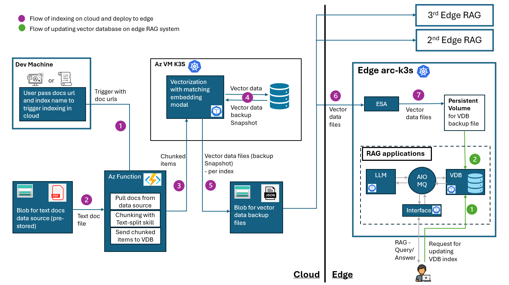

# Vector Data Deployment to Multiple Edge Vector DBs

For Rag-on-Edge pattern on a single machine, we have developed a solution [here](https://github.com/Azure-Samples/azure-edge-extensions-retrieval-augmented-generation).
However in scenarios where multiple edge machines implementing the RAG-on-Edge pattern are located across different locations, keeping the edge vector DBs updated becomes crucial. If these databases are not synchronized promptly with the up-to-date vector searching data content, search and generation tasks can become inefficient. Additionally, if an edge vector DB fails and data is lost, restoring the data efficiently is another major concern.

This repository provides a solution to these challenges by hosting a vector DB in the cloud as a central hub, and deploying vector data to synchronize edge vector DBs across multiple edge machines. This approach ensures that RAG-on-Edge systems operate efficiently with up-to-date vector data content. It also offers an efficient method to restore vector DB data on edge machines in case of data loss.

The sample works with Azure Arc Kubernetes management with [Azure IoT Operations](https://learn.microsoft.com/en-us/azure/iot-operations/get-started/overview-iot-operations) suite, and [Edge Storage Accelerator (ESA)](https://learn.microsoft.com/en-us/azure/azure-arc/edge-storage-accelerator/) Azure-Arc extension.

## Architecture Overview



The architecture consists of 2 main processes:

- Indexing on the Cloud and Deploying to Edge
- Updating Vector DBs on Edge Machines

We use [Chroma Vector DB](https://www.trychroma.com/) in this sample.

### Process 1: Indexing on the Cloud and Deploying to Edge

Text documents should be pre-stored in cloud storage. In this sample, we use Azure Blob Storage to store PDF text files. These text files will be indexed and embedded into a cloud-hosted vector database, referred to as the "vector DB leader". The vector DB leader acts as the central hub responsible for synchronizing vector data to multiple edge machines.

Steps:

1. The user triggers the Azure Function via passing the text file's blob URL and target index name through a UI or script.
2. The Azure Function downloads the text file from the Azure Blob Storage, extracts and chunks the text content, and sends the chunked items to the vector DB leader in the cloud.
3. The vector DB leader embeds the chunked text content and stores it in the target index.
4. A snapshot of the vector data is taken from the target index, creating a backup JSON file.
5. The backup JSON file is sent to the Azure Blob Storage which is accessible by the edge machines via ESA Arc extension.
6. The ESA Arc extension synchronizes the backup JSON files from Azure Blob Storage to the local file system of the edge machine.
7. The backup JSON file is available at the edge machine persistent volume which is tied to the vector DB follower edge application.

### Process 2: Updating Vector Databases on Edge Machines

The frequency of updating the vector database on the edge can be determined by the end user, who can trigger the update process according to their own logic. In this sample, a web UI allows users to input the index name for updating or restoring the edge vector database. The edge vector database in this example is referred to as the "vector DB follower".

The vector DB follower is updated with vector data from the local file system, originally sourced from the vector DB leader and synchronized via [Edge Storage Accelerator(ESA) Azure-Arc extension](https://learn.microsoft.com/en-us/azure/azure-arc/edge-storage-accelerator/).

Steps:

1. The user requests to update the vector DB follower on the edge by inputting the target index name through the web UI.
2. The vector DB follower application retrieves the vector DB backup JSON file from the persistent volume, and restores the vector data into the target index of the vector DB follower.

## Getting Started

### Prerequisites

- Prepare one or more edge machines via following the prerequisites in the [Retrieval Augmented Generation on Edge](https://github.com/Azure-Samples/azure-edge-extensions-retrieval-augmented-generation) to have the setup of Retrieval Augmented Generation solution running on Edge.
- An Azure VM Ubuntu with K3S cluster installed for hosting the vector DB leader on the cloud. Follow the steps in [Deploying K3S Cluster to Ubuntu](https://docs.k3s.io/quick-start).
- Create Function App under the resource group of vector DB leader host VM via following the steps in [Create a function app](https://docs.microsoft.com/en-us/azure/azure-functions/create-first-function-cli-python?tabs=bash%2Cbrowser&pivots=programming-language-python).
- Create a Azure Blob Storage account and container for storing the text files. Follow the steps in [Create a storage account](https://docs.microsoft.com/en-us/azure/storage/common/storage-account-create?tabs=azure-portal). You may upload the pdf files in /data/test-files folder to the Blob Storage container for demo purpose.
- Create a Azure Blob Storage account and a container "rag-vdb" for storing the backup JSON files and linked to ESA Arc extension on the edge. Follow the steps in [Create a storage account](https://docs.microsoft.com/en-us/azure/storage/common/storage-account-create?tabs=azure-portal).

### Installation

- We will use one of the Edge Machines as the Develop machine to execute the sample via webUI. Follow the installation setup in [Retrieval Augmented Generation on Edge](https://github.com/Azure-Samples/azure-edge-extensions-retrieval-augmented-generation).

### Quick Start

1. Download the repo to your local dev machine.

  ```bash
  git clone <repo url>
  ```

2. For the edge machines with vector DB follower application, you need to deploy the rag components from the folder ./src/edge-rag-components-edgeVDB instead for the demo in this sample. You need to config your Azure Function http trigger URL FUNCTION_URL in ./src/edge-rag-components-edgeVDB/rag-on-edge-web/page_data_deployment.py.
In addition to the setup in [Retrieval Augmented Generation on Edge](https://github.com/Azure-Samples/azure-edge-extensions-retrieval-augmented-generation), you need to install Edge Storage Accelerator (ESA) Azure-Arc extension and link edge to your vector data Azure Blob Storage container "rag-vdb". Follow the steps in [Install Edge Storage Accelerator](https://learn.microsoft.com/en-us/azure/azure-arc/edge-storage-accelerator/how-to-single-node-k3s). You may refer ./deploy/esa for your ESA configurations.

3. Deploy the vector DB leader application to your Azure VM Ubuntu which has K3S cluster installed. Containerize the vector DB leader application with following commands. Configure VECTOR_DATA_SOURCE_STORAGE_CONNECTION_STRING = f"" in ./src/cloud-vectorDB/module/VDBModule/main.py.

  ```bash
  cd src/cloud-vectorDB/module/VDBModule
  docker build -t <your-acr-host>/cloud-vectordb:latest .
  docker push <your-acr-host>/cloud-vectordb:latest
  ```

  Deploy the vector DB leader application to the K3S cluster.

  ```bash
  kubectl apply -f ./deploy/yaml/cloud-vdb-workload.yaml
  ```

4. Deploy the Azure Function code in ./src/az-func-chunking to your Azure Function App. Following [Create a function in Azure](https://learn.microsoft.com/en-us/azure/azure-functions/create-first-function-vs-code-python).

> [!NOTE]
> In ./src/az-func-chunking/local.settings.json, configure "Values.AzureWebJobsStorage" with the connection string of an Azure Blob Storage as your choice.

5. In the edge machine which has the rag-on-edge web application running, then you can open up the web UI in your local develop machine browser via configuring [port-forwarding](https://kubernetes.io/docs/tasks/access-application-cluster/port-forward-access-application-cluster/#forward-a-local-port-to-a-port-on-the-pod), and navigate to the webpage "Deploy Vector Data to Edge". The web UI is accessible via `http://<edge machine public ip address>:8501`.

6. On the web UI page, go to the section "Triggering cloud indexing" for a quick demo of triggering process 1- indexing of Benefit_Options.pdf as you previously uploaded as a text source file to the Azure Blob Storage. Input the target index name that you want this file to save in the cloud vector DB leader. The vector DB leader will embed the text content with Chroma default embedding model, store into the vector DB, and retrieve the vector data as a backup JSON file.
Alternatively, you may directly run this script in ./src/dev-machine-app/user-app.py with your Azure Function trigger URL configured.

  ```bash
  python ./src/dev-machine-app/user-app.py
  ```

7. Go to the vector data Azure Blob Storage, you should see the backup JSON file in the container "rag-vdb".

8. On the web UI page, go to the section "Deploy Cloud Vector Data". You may either select the radio button to update an existing index of vector DB follower, or to input an index name to create a new index to backup the vector content. Then click the "Update Index Contents" button to trigger the process 2 - updating the vector DB follower with the backup JSON file synchronized at the edge.

9. (Optional) You may also use the web UI page to verify the vector data content in the vector DB follower by performing a vector search and generation task on the webpage "Vector Search".

## Resources

- [Retrieval Augmented Generation on Edge](https://github.com/Azure-Samples/azure-edge-extensions-retrieval-augmented-generation)
- [Chroma Vector DB](https://www.trychroma.com/)
- [What Is Retrieval-Augmented Generation (RAG)](https://www.oracle.com/sg/artificial-intelligence/generative-ai/retrieval-augmented-generation-rag/)
- [What is vector search](https://www.algolia.com/blog/ai/what-is-vector-search/?utm_source=google&utm_medium=paid_search&utm_campaign=rl_emea_search_dstalg_nb_dynamic&utm_content=blog_ai_dynamic&utm_term=&utm_region=emea&utm_model=nonbrand&utm_ag=rl&utm_camp_parent=slg&utm_2nd_camp=dstalg&_bt=677640514505&_bm=&_bn=g&gad_source=1&gclid=EAIaIQobChMIr9aMkaHDgwMV06tmAh1hXQH8EAAYASAAEgIY_fD_BwE)
